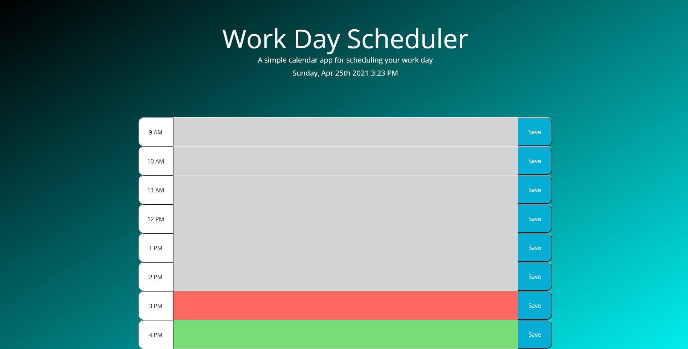

# 05 Third-Party APIs: Work Day Scheduler

For this project, I was given the task of making a scheduler for my work day that was color-coded based on past, present, and future timeblocks in the work day. Using jQuery, I was asked to save items to local storage and display them in the given calendar block, without losing the items upon a page refresh.

In completing this project, I now have a functional planner that someone could use for planning out a single work day in hourly events, and have a quick visual reference of where they were in the flow of the daily events. 

In building this page and designing it, I went for less of a game-based aesthetic, and tried to keep it a bit more clean and professional. I also spent many (read: MANY) hours reading about jQuery and different ways to apply the syntax to this project. One of the interesting topics I studied a lot was the concept of "this", and how you can use it to refer to local objects as well as the global object/document.

I struggled with this project, and tried several different iterations of code unsuccessfully before learning some new concepts that we did not get into in class. I also learned after speaking with a tutor, an instructor, an industry professional, and a recent grad, that there are many different ways that people can approach a project like this. I find this to be liberating in it's flexibility, but daunting in the variations of ways to learn about in the future. 

I think that this page works well, and improves on my use of local storage. I also was able to develop some new appreciation for the variety in coding possibilities. I can safely say that I have never spent more hours in one week on any project in my life than I did finding a way to make this work!

LINK TO LIVE PROJECT:

https://brandoncowley.github.io/WorkDayScheduler/

